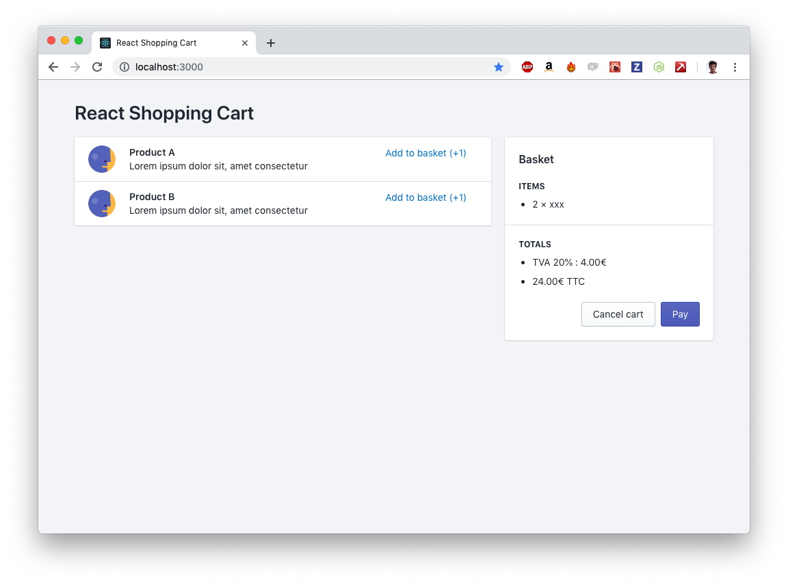

# react-shopping-cart


---

Ce projet a été démarré avec [Create React App](https://github.com/facebook/create-react-app).

## Démarrage

Pour initialiser l'application et la lancer dans un mode de développement :

```shell
$ yarn 
$ yarn start
```

Ouvrir la page [`http://localhost:3000`](http://localhost:3000) pour voir l'application dans votre navigateur.

La page se mettra à jour si vous faites une modification du code. Vous verrez également toutes les erreur Eslint et Typescript dans la console.

## Explication



L'objectif de ce test est de recréer un système de panier comme l'on peut trouver sur de nombres sites e-commerce. Vous trouverez en ouvrant le fichier `src/App.tsx` l'ossature de l'application avec un set de données présent et quelques balises `html` pour structurer la page.

Rien n'a encore été dynamiser dans l'interface, vous aurez donc l'objectif de :
* [ ] permettre l'ajout d'un produit au panier
* [ ] permettre la suppresion d'un produit présent dans le panier
* [ ] calculer automatique le montant total du panier ainsi que les différentes TVA
* [ ] [ajouter un système de recherche dans les produits du catalogue](https://polaris.shopify.com/components/lists-and-tables/resource-list#all-examples)
* [ ] et d'ajouter des fonctionnalités en plus de votre choix

## Documentation

### Quelques points à prendre en compte

* L'équipe technique suit une **logique de développement `cross-platform`**. En effet, Wino propose à ses clients des outils pour différentes plateformes : iOS, Mac, Windows ... De ce fait, le développement technique de chaque fonctionnalité doit être réfléchi pour pouvoir être un maximum partagé entre chaque codebase.

* **La gestion comptable** est un élément clé des produits Wino. Cela représente un enjeu technique majeur car cela nécessite une **rigeuur extrême** dans le développement de services de calculs de données comptables. Aucune erreur n'est permise. Pour parvenir à cela, l'équipe Wino a mis en place un ensemble de procédure et défini des bonnes pratiques complète.

* Afin de faciliter le développement technique de nos produits, nous nous basons sur la librairie **`Polaris` de Shopify** pour la création d'interface utilisateur pour la plateforme web. Toute la documuentation est accessible à l'adresse suivante : [polaris.shopify.com](https://polaris.shopify.com).

* **L'application a été initialisé avec [`Typescript`](https://www.typescriptlang.org/).** Cela permet de typer le code Javascript écrit pour ainsi le rendre plus sur.

### Quelques astuces

* Le calcul des TVA répond à l'application de formules mathémathiques simples. Vous trouverez des exemples en accédant au site suivant [calculertva.com/](http://www.calculertva.com/). Les quelques formules à connaitre :
```
[Montant HT] x (1 + ([Taux TVA] / 100))=[Montant TTC] 
[Montant HT] x ([Taux TVA] / 100)=[Montant TVA] 
[Montant TTC] / (1 + ([Taux TVA] / 100))=[Montant HT] 
```

* Javascript possède quelques "particularités" dans les calculs des décimals. La gestion des arrondis est un élément central à prendre en compte lors de manipulations numériques. En jetant un coup d'oeil à l'exemple suivant, on comprend immédiatement les problèmatiques que cela peut engendrer :
```
> 0.1+0.2
> 0.30000000000000004  🙃
```

## Les plus

Une fois avec répondu avec soin aux objectifs de bases de l'exercice, vous pourrez effectuer quelques améliorations supplémentaires, quelques idées :
* Gérer un système de devise (€, $ ...)
* Transformer le code en ReasonML pour avoir une codebase plus sur
* Ajouter un système de remise
* Créer un système de cache pour que les paniers ne soient pas perdus même après rafraichissement de la page
* Relier l'application à une API externe qui retourne des produits au format JSON
* Ajouter un système de paiement
* ...